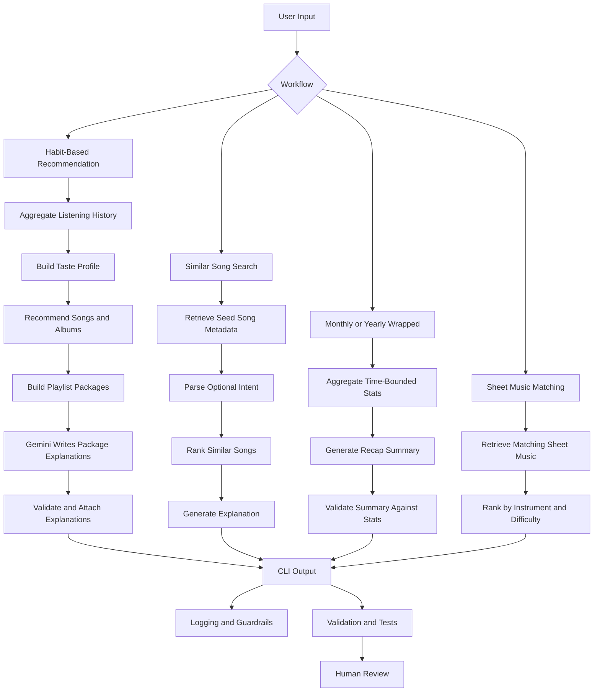

# Music Companion

## Project Overview
Music Companion is an AI-powered music discovery and reflection app built on top of a base content-based recommender. The original project ranked songs from a small catalog using handcrafted feature matching. This expanded version keeps that explainable scoring core and adds four user-facing workflows:

1. Similar-song recommendation from a searched song
2. User-level song and album recommendation from listening history
3. Monthly and yearly listening summaries
4. Metadata-based sheet music matching for light piano and guitar arrangements

The project uses structured retrieval-grounded generation, Gemini-powered intent parsing, optional Gemini narrative/explanation layers, and reliability guardrails. The main design principle is that deterministic code owns retrieval, ranking, IDs, validation, and fallback behavior, while Gemini only helps parse intent or explain already-retrieved data.

## Original Project
This project extends the original **Music Recommender Simulation** from Modules 1 to 3. The original version represented songs and user preferences as structured data, applied weighted feature matching to score songs, and returned ranked recommendations with short explanations. It already supported multiple scoring modes and diversity-aware ranking, but it did not yet include retrieval-driven song search, listening-history analysis, recap generation, or sheet music matching.

## Base Functionality
The base project is a content-based music recommender simulation. Each song in the catalog is represented with structured metadata such as genre, mood, energy, acousticness, instrumentalness, popularity, decade, language, duration, and mood tags. A user profile stores preferences over those features, and the system assigns a score to each song based on how closely the song matches the profile.

The current scoring engine in [src/recommender.py](src/recommender.py) includes:

- weighted feature matching
- multiple scoring modes
- optional diversity penalties
- human-readable explanations for each recommendation

This base logic remains the ranking backbone of the app.

## Implemented Workflows
The expanded project adds four workflows on top of the scoring engine. Some workflows use Gemini directly, while others are primarily deterministic with optional AI-written explanations.

### 1. Similar Song Recommendation
The user searches for a song, and the system retrieves the seed song's metadata before finding other songs with similar attributes such as genre, mood, energy, decade, language, and tags. The user can also provide a natural-language intent, such as "more energetic but still instrumental for studying." When a `GEMINI_API_KEY` is available, Gemini parses that intent into structured ranking adjustments; otherwise, the app falls back to a local rule-based parser. If Gemini times out or returns an invalid response, the fallback happens automatically and the CLI displays the fallback source.

Implemented CLI:

```bash
python3 -m src.main similar --song "Song Title"
python3 -m src.main similar --song "Library Rain" --intent "more energetic but still instrumental for studying"
```

### 2. Habit-Based Recommendation
The system analyzes a user's listening history, builds a taste profile, and recommends songs and albums that fit that profile. It aggregates play counts, completed plays, genres, moods, languages, artists, tags, and average energy before ranking new songs and albums. It then groups ranked songs into playlist packages such as `Core Taste Mix`, `Context Fit`, and `Discovery Stretch`.

Gemini is used only after retrieval and ranking are complete. The app sends a compact context containing the taste profile, top listening signals, top ranked songs, top ranked albums, package names, and optional user context. Gemini returns short package explanations in a fixed line-based format, while the local application keeps control of song IDs, playlist structure, validation, and fallback behavior.

Implemented CLI:

```bash
python3 -m src.main recommend --user user_001
python3 -m src.main recommend --user user_001 --context "rainy night study"
```

### 3. Monthly and Yearly Music Wrapped
The system aggregates a user's listening history by month or year and generates a recap with capped rankings: up to 10 top songs, 5 top artists, 5 inferred top albums, 5 top genres, 5 top moods, and 5 top tags. These rankings and taste statistics are deterministic because they come directly from listening-history aggregation. Gemini is optional and only used as a narrative layer that rewrites the computed statistics into a more natural recap summary; if Gemini is unavailable, the app uses a deterministic summary and reports the fallback reason.

Implemented CLI:

```bash
python3 -m src.main wrapped --user user_001 --period year --year 2026
python3 -m src.main wrapped --user user_001 --period month --year 2026 --month 4
```

### 4. Sheet Music Matching
The system finds sheet music entries that best match a requested song, instrument, and optionally a difficulty level. The current implementation focuses on metadata-based matching for light music arrangements, especially piano and guitar. Matching and ranking are deterministic: the app retrieves the song, filters by instrument, scores arrangement metadata, and returns ranked sheet music options. Gemini is optional and only writes a short explanation for the top match from retrieved metadata.

Implemented CLI:

```bash
python3 -m src.main sheet --song "Library Rain" --instrument piano --difficulty beginner
python3 -m src.main sheet --song "Focus Flow" --instrument guitar --difficulty beginner --no-gemini
```

## AI Integration
This project treats AI as part of the main application flow, not as a standalone add-on.

### Retrieval-Augmented Generation
Before the system generates recommendations, summaries, or explanations, it first retrieves structured context:

- song metadata for searched songs
- listening history statistics for user recaps
- album metadata for habit-based recommendation
- sheet music metadata for instrument-specific matching

The generated output is therefore grounded in retrieved data rather than produced from an empty prompt.

### Gemini Usage Boundaries
For similar-song search, Gemini is used as a constrained intent parser. It does not directly choose songs. Instead, it converts natural-language requests into structured fields such as `energy_delta`, `preferred_mood`, `required_language`, and `preferred_tags`. The deterministic scoring engine then uses those fields to rank songs, which keeps the final recommendation explainable and testable.

For habit-based recommendation, Gemini is used as a grounded playlist explainer. The local system first aggregates listening history, ranks songs and albums, and builds playlist packages. Gemini then receives a compact retrieved context and writes only the `why_it_fits` explanation for each package. It does not choose songs, invent IDs, or change package membership.

For monthly and yearly wrapped recaps, the core work is deterministic statistics, not AI generation. The local system computes top songs, top artists, inferred top albums, genres, moods, tags, and average energy from listening history. Gemini is optional and only writes a short narrative summary from those computed statistics, while deterministic fallback text remains available if the AI call fails.

For sheet music matching, the core work is deterministic metadata retrieval and ranking. The local system matches the requested song, instrument, and difficulty against sheet music metadata. Gemini is optional and only writes a short explanation of why the top ranked arrangement fits; it does not invent sheet music links or change the ranking.

### Reliability and Validation
The project also includes a reliability layer:

- recap outputs are grounded in computed listening-history statistics
- missing or ambiguous queries trigger fallback behavior
- invalid inputs are handled safely
- retrieval and ranking steps are logged for debugging
- Gemini intent outputs are validated and clamped before they affect ranking
- Gemini playlist explanations are attached to locally generated package structures rather than trusted to define recommendation membership
- Gemini sheet music explanations are grounded in retrieved arrangement metadata and do not create new sheet music entries
- truncated or too-short Gemini sheet music explanations are rejected and replaced with deterministic fallback text
- local deterministic fallback explanations are used when Gemini is unavailable, times out, exceeds quota, or returns an unparsable response, and the CLI labels deterministic, AI-generated, and fallback sections explicitly

These guardrails are part of the application logic and are intended to reduce unsupported or misleading outputs.

## System Architecture
The system architecture diagram is stored in the `assets/` folder and can be embedded here as an image or represented as a Mermaid diagram.



## Architecture Overview
The system is organized around a retrieval-first pipeline. User input enters through the command-line interface and is routed into one of the main workflows: similar-song search, habit-based recommendation, listening recap, or sheet music matching. Each workflow retrieves structured context from the relevant dataset before ranking, summarization, or matching takes place. The output is then checked through validation, logging, automated tests, and human review so that the system can surface grounded results and make failures easier to inspect.

## Repository Structure
```text
src/
data/
tests/
assets/
README.md
model_card.md
requirements.txt
```

## Data
### Current Datasets
The repository currently includes:

- [data/songs.csv](data/songs.csv), which stores the song catalog used by the base recommender and similar-song search.
- [data/albums.csv](data/albums.csv), which stores album-level metadata for habit-based album recommendation.
- [data/listening_history.csv](data/listening_history.csv), which stores simulated user listening logs with timestamps and play counts.

### Sheet Music Dataset
The repository also includes [data/sheet_music.csv](data/sheet_music.csv), which stores sheet music metadata for piano and guitar arrangements, including difficulty, arrangement style, key signature, page count, source type, mood tags, and beginner-friendly flags.

## Setup
### 1. Create a virtual environment
```bash
python3 -m venv .venv
source .venv/bin/activate
```

### 2. Install dependencies
```bash
pip install -r requirements.txt
```

### 3. Optional: configure Gemini
Gemini intent parsing and playlist explanations are optional. If no API key is configured, the app uses local fallback behavior. If Gemini is configured but times out or fails, the app automatically uses the fallback parser or deterministic playlist explanations and reports the fallback reason.

Create a local `.env` file in the project root:

```bash
touch .env
```

Add your Gemini API key to `.env`:

```bash
GEMINI_API_KEY=your-api-key
```

The app loads `.env` automatically through `python-dotenv`, so you do not need to export the key every time you open a new terminal. This keeps local development convenient while avoiding hardcoded secrets in the source code. The default Gemini model is `gemini-2.5-flash`. You can override it in `.env` if needed:

```bash
GEMINI_MODEL=gemini-2.0-flash
```

Do not commit API keys to the repository. Local `.env` files are ignored by git, so `git add .` will not stage your Gemini key unless you force-add `.env` manually.

### 4. Run the current base application
```bash
python3 -m src.main
```

## How to Run
### Current Working Flows
The repository currently supports the base recommender demo through:

```bash
python3 -m src.main
```

It also supports Feature 1, similar-song recommendation:

```bash
python3 -m src.main similar --song "Library Rain"
python3 -m src.main similar --song "Library Rain" --intent "more energetic but still instrumental for studying"
python3 -m src.main similar --song "Library Rain" --intent "more energetic but still instrumental for studying" --no-gemini
```

It also supports Feature 2, habit-based song and album recommendation:

```bash
python3 -m src.main recommend --user user_001
python3 -m src.main recommend --user user_001 --k 3 --albums-k 2
python3 -m src.main recommend --user user_001 --context "rainy night study" --no-gemini
```

It also supports Feature 3, monthly and yearly listening wrapped recaps:

```bash
python3 -m src.main wrapped --user user_001 --period year --year 2026
python3 -m src.main wrapped --user user_001 --period month --year 2026 --month 4
python3 -m src.main wrapped --user user_001 --period year --year 2026 --no-gemini
```

It also supports Feature 4, sheet music matching:

```bash
python3 -m src.main sheet --song "Library Rain" --instrument piano --difficulty beginner
python3 -m src.main sheet --song "Focus Flow" --instrument guitar --difficulty beginner --no-gemini
```

### CLI Flags and Confidence Scores
The `--k` flag controls how many recommendations are returned. For example, `--k 3` returns the top three similar songs; it does not control whether Gemini is called.

Gemini is only used when the user provides `--intent` and a `GEMINI_API_KEY` is available. If `--no-gemini` is provided, the app always uses the local rule-based parser.

The CLI reports three different scoring concepts:

- **Search confidence:** how confidently the system matched the user's song query to a seed song.
- **Intent confidence:** how confidently Gemini or the fallback parser understood the natural-language intent.
- **Song score:** how well each recommended song matches the final adjusted profile.

For common requests, the local rule-based fallback often agrees with Gemini. For more nuanced language, Gemini provides more flexible intent extraction, while the fallback keeps the app reliable if the API fails. If Gemini fails, the app reports a fallback reason such as `HTTPError_403`, `HTTPError_429`, or `URLError`.

## Example Workflows
The following workflows describe the command-line interface for the expanded app. Similar-song search, habit-based recommendation, wrapped recaps, and sheet music matching are implemented.
### Example 1: Similar Song Search
Input:

```bash
python3 -m src.main similar --song "Yellow"
```

Target output:

- retrieved seed song
- top similar songs
- explanation of shared features

Current example output summary:

- Query: `Library Rain`
- Matched seed song: `Library Rain` by `Paper Lanterns`
- Search confidence: `1.00`
- Top similar results include `Midnight Coding`, `Focus Flow`, and `Spacewalk Thoughts`
- With intent `more energetic but still instrumental for studying`, the parser increases target energy, keeps instrumental preference, adds a focused tag, and moves `Focus Flow` to the top result.

Example interaction summary:

- The system identifies the searched song as the seed track.
- It retrieves the seed track's metadata and builds a similarity profile.
- It returns several similar songs along with a brief explanation of the shared features.

### Example 2: Habit-Based Recommendation
Input:

```bash
python3 -m src.main recommend --user user_001 --context "rainy night study"
```

Target output:

- deterministic taste profile summary from listening history
- deterministic ranked song recommendations
- deterministic ranked album recommendations
- Gemini-generated playlist package explanations when the API is available

Current example output summary:

- The system aggregates `user_001` listening history into genre, mood, tag, artist, language, and energy signals.
- It ranks songs and albums locally using the scoring engine.
- It builds playlist packages locally, then asks Gemini to write short explanations grounded in the retrieved history and ranked candidates.
- When Gemini succeeds, the CLI prints `AI-generated section` and `source: gemini`; when Gemini fails, it prints `AI fallback section` with a fallback reason.

### Example 3: Yearly Wrapped
Input:

```bash
python3 -m src.main wrapped --user user_001 --period year --year 2026
```

Current output:

- up to 10 top songs by weighted plays
- up to 5 top artists
- up to 5 inferred top albums from available album metadata
- up to 5 top genres, moods, tags, plus average energy
- deterministic taste summary, optionally rewritten by Gemini from the computed stats

Current example output summary:

- The system filters `user_001` listening history to 2026.
- It computes capped rankings instead of dumping the full listening log; for the current sample data, `Focus Flow` is the top song, `LoRoom` is the top artist, and `Night Study Tapes` is the top inferred album.
- It summarizes the user's taste as lofi/chill/focused with low average energy.

### Example 4: Sheet Music Matching
Input:

```bash
python3 -m src.main sheet --song "Library Rain" --instrument piano --difficulty beginner
```

Current output:

- matched catalog song and search confidence
- ranked sheet music entries for the requested instrument
- difficulty, arrangement style, key signature, page count, and match score
- deterministic or Gemini-written explanation grounded in sheet metadata

Current example output summary:

- The system matches `Library Rain` by `Paper Lanterns` with search confidence `1.00`.
- It ranks the beginner piano arrangement as the top sheet music match.
- The explanation references the retrieved arrangement metadata instead of inventing external links or unavailable scores.

## Demo Walkthrough
Add one of the following before submission:

- a Loom link showing the system end to end with at least 2 to 3 example inputs
- or a walkthrough using screenshots or GIFs stored in `assets/`

Suggested demo files:

- `assets/demo-similar.png`
- `assets/demo-recommend.png`
- `assets/demo-wrapped.png`
- `assets/demo-sheet.png`

## Logging and Guardrails
The system includes several reliability guardrails:

- safe handling of missing or ambiguous song queries
- input validation for command arguments such as period, month, instrument, and difficulty
- deterministic fallback when Gemini is unavailable, times out, exceeds quota, or returns invalid output
- explicit CLI labels for deterministic, AI-generated, and AI fallback sections
- rejection of truncated Gemini sheet music explanations
- debug support with `DEBUG_GEMINI=1` for inspecting raw Gemini response metadata

## Testing Summary
Run the current test suite with:

```bash
pytest
```

The current test suite passes with `41 passed`. These tests cover base recommendation scoring, song search, similar-song ranking, intent parsing and fallback behavior, listening-history aggregation, song and album recommendation, playlist package validation, wrapped recap period filtering, top song/artist/album statistics, sheet music loading and ranking, instrument and difficulty filtering, truncated AI explanation rejection, Gemini debug-response logging, and missing-user handling.

The main reliability finding is that transparent scoring and deterministic fallback make the system debuggable even when Gemini fails, times out, exceeds quota, or returns low-quality text.

## Design Decisions
- The project keeps the original rule-based scoring engine because it is transparent, explainable, and easier to validate than a fully opaque recommendation model.
- Retrieval happens before generation so that recommendations, summaries, and explanations are grounded in structured music data rather than produced from an empty prompt.
- The system is organized as multiple focused workflows instead of one general chatbot so that each use case can be developed, tested, and debugged separately.
- Validation and logging are treated as product features rather than afterthoughts because recommendation systems can sound convincing even when their outputs are unsupported.
- The current design favors explainability and reproducibility over maximum realism; this is a deliberate trade-off given the project scope and dataset size.

## Results and Observations
The base recommender already demonstrates several useful behaviors:

- explainable weighted ranking
- multiple scoring modes
- diversity-aware ranking
- stress testing with adversarial user profiles

At the same time, the current system also reveals important limitations:

- strong dependence on catalog coverage
- exact-match rigidity for mood and genre
- underuse of some available metadata fields
- possible feedback loops from popularity and language imbalance

These observations motivate the move toward retrieval-driven workflows and stronger validation in the expanded app.

## Limitations
- The current catalog is small and partially simulated.
- Metadata quality strongly affects recommendation quality.
- The current recommender is still metadata-based rather than audio-based.
- Wrapped recap quality depends on the quality and coverage of listening-history data.
- Sheet music matching is based on metadata retrieval, not automatic transcription or real-time score generation.

## Future Work
- AI performer workflows and Suno-style reinterpretation prompts
- live sheet music provider or licensed API integration instead of local metadata only
- multi-instrument arrangement planning
- audio embedding similarity instead of metadata-only matching
- richer album, playlist, and recap datasets

## Reflection
Building Music Companion reinforced that useful AI systems depend on more than generation alone. Retrieval, ranking, validation, and fallback behavior all matter if the system is expected to produce outputs that are understandable and trustworthy. This project also highlighted a practical trade-off: explainable systems are easier to debug and document, but they still depend heavily on the quality and coverage of the underlying data. For a deeper discussion of biases, risks, testing, and human-AI collaboration, see [model_card.md](model_card.md).
