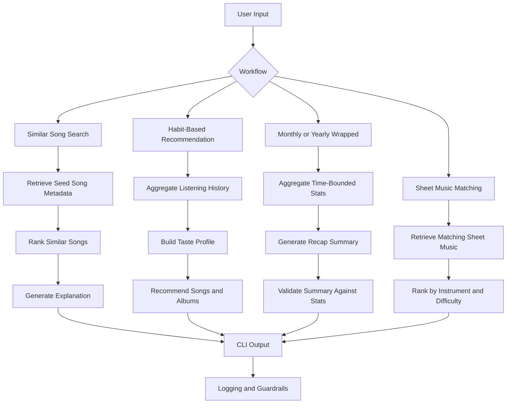

# Music Companion

## Project Overview
Music Companion is an AI-powered music discovery and reflection app built on top of a base content-based recommender. The original project ranked songs from a small catalog using handcrafted feature matching. This expanded version keeps that explainable scoring core and extends it into a broader AI-assisted music experience with four user-facing workflows:

1. Similar-song recommendation from a searched song
2. Personalized song and album recommendation from listening history
3. Monthly and yearly listening recap generation
4. Sheet music matching for light music, especially piano and guitar

Its main goal is to show how retrieval, ranking, summarization, and guardrails can work together inside one music application.

## Base Functionality
The base project is a content-based music recommender simulation. Each song in the catalog is represented with structured metadata such as genre, mood, energy, acousticness, instrumentalness, popularity, decade, language, duration, and mood tags. A user profile stores preferences over those features, and the system assigns a score to each song based on how closely the song matches the profile.

The current scoring engine in [src/recommender.py](/Users/yichen/Downloads/School/算法课/CodePath/AI110/Week8/music-recommender-ai-lab/src/recommender.py) includes:

- weighted feature matching
- multiple scoring modes
- optional diversity penalties
- human-readable explanations for each recommendation

This base logic remains the ranking backbone of the app.

## AI-Enhanced Functionality
The extended project adds four AI-related workflows on top of the scoring engine.

### 1. Similar Song Recommendation
The user searches for a song, and the system retrieves the seed song's metadata before finding other songs with similar attributes such as genre, mood, energy, decade, language, and tags.

Planned CLI:

```bash
python -m src.main similar --song "Song Title"
```

### 2. Habit-Based Recommendation
The system analyzes a user's listening history, builds a taste profile, and recommends songs and albums that fit that profile.

Planned CLI:

```bash
python -m src.main recommend --user user_001
```

### 3. Monthly and Yearly Music Wrapped
The system aggregates a user's listening history by month or year and generates a recap with top songs, top artists, top albums, and a natural-language taste summary.

Planned CLI:

```bash
python -m src.main wrapped --user user_001 --period year --year 2026
```

### 4. Sheet Music Matching
The system finds sheet music entries that best match a requested song, instrument, and optionally a difficulty level. The first version focuses on metadata-based matching for piano and guitar.

Planned CLI:

```bash
python -m src.main sheet --song "River Flows in You" --instrument piano
```

## AI Integration
This project treats AI as part of the main application flow, not as a standalone add-on.

### Retrieval-Augmented Generation
Before the system generates recommendations, summaries, or explanations, it first retrieves structured context:

- song metadata for searched songs
- listening history statistics for user recaps
- album metadata for habit-based recommendation
- sheet music metadata for instrument-specific matching

The generated output is therefore grounded in retrieved data rather than produced from an empty prompt.

### Reliability and Validation
The project also includes a reliability layer:

- recap outputs are checked against computed statistics
- missing or ambiguous queries trigger fallback behavior
- invalid inputs are handled safely
- retrieval and ranking steps are logged for debugging

These guardrails are part of the application logic and are intended to reduce unsupported or misleading outputs.

## System Architecture
The final system diagram should be stored in `assets/` and either embedded here as an image or represented as a Mermaid diagram.



## Repository Structure
```text
src/
data/
tests/
assets/
README.md
model_card.md
requirements.txt
```

## Data
### Current Dataset
The repository currently includes [data/songs.csv](/Users/yichen/Downloads/School/算法课/CodePath/AI110/Week8/music-recommender-ai-lab/data/songs.csv), which stores the music catalog used by the base recommender.

### Planned Datasets
The full application design also expects:

- `data/albums.csv` for album-level metadata
- `data/listening_history.csv` for user listening logs with timestamps
- `data/sheet_music.csv` for sheet music matching

These datasets will support features 2 to 4.

## Setup
### 1. Create a virtual environment
```bash
python -m venv .venv
source .venv/bin/activate
```

### 2. Install dependencies
```bash
pip install -r requirements.txt
```

### 3. Run the current base application
```bash
python -m src.main
```

## How to Run
### Current Working Flow
The repository currently supports the base recommender demo through:

```bash
python -m src.main
```

### Planned Extended Commands
These commands represent the target interface for the expanded app:

```bash
python -m src.main similar --song "Song Title"
python -m src.main recommend --user user_001
python -m src.main wrapped --user user_001 --period month --month 2026-04
python -m src.main wrapped --user user_001 --period year --year 2026
python -m src.main sheet --song "Song Title" --instrument piano
```

## Example Workflows
### Example 1: Similar Song Search
Input:

```bash
python -m src.main similar --song "Yellow"
```

Expected output:

- retrieved seed song
- top similar songs
- explanation of shared features

### Example 2: Habit-Based Recommendation
Input:

```bash
python -m src.main recommend --user user_001
```

Expected output:

- recommended songs
- recommended albums
- short taste profile summary

### Example 3: Yearly Wrapped
Input:

```bash
python -m src.main wrapped --user user_001 --period year --year 2026
```

Expected output:

- top 10 songs
- top artists
- top albums
- yearly taste summary

### Example 4: Sheet Music Matching
Input:

```bash
python -m src.main sheet --song "River Flows in You" --instrument piano
```

Expected output:

- matching sheet music entries
- instrument fit
- difficulty notes

## Demo Walkthrough
Add one of the following before submission:

- a Loom link showing the system end to end with at least 2 to 3 example inputs
- or a walkthrough using screenshots or GIFs stored in `assets/`

Suggested demo files:

- `assets/demo-similar.png`
- `assets/demo-recommend.png`
- `assets/demo-wrapped.png`
- `assets/demo-sheet.png`

## Existing Screenshots
The repository already includes several screenshots from the original recommender experiments. These are stored in `assets/` and can be retained as evidence of the base system behavior, but the final submission should also include updated screenshots for the expanded workflows.

- 
- 
- 
- 
- 
- 
- 

## Logging and Guardrails
The final system is expected to include:

- structured logging for retrieval, ranking, and recap generation
- safe handling of missing song queries
- input validation for command arguments
- recap validation against computed statistics
- fallback messaging for insufficient listening history or missing sheet music

## Testing
Run the current test suite with:

```bash
pytest
```

The expanded test plan should cover:

- seed-song retrieval correctness
- similar-song ranking behavior
- user taste aggregation from history
- monthly and yearly recap statistics
- recap validation logic
- sheet music matching behavior
- edge cases for missing or ambiguous data

## Results and Observations
The base recommender already demonstrates several useful behaviors:

- explainable weighted ranking
- multiple scoring modes
- diversity-aware ranking
- stress testing with adversarial user profiles

At the same time, the current system also reveals important limitations:

- strong dependence on catalog coverage
- exact-match rigidity for mood and genre
- underuse of some available metadata fields
- possible feedback loops from popularity and language imbalance

These observations motivate the move toward retrieval-driven workflows and stronger validation in the expanded app.

## Limitations
- The current catalog is small and partially simulated.
- Metadata quality strongly affects recommendation quality.
- The current recommender is still metadata-based rather than audio-based.
- Planned recap features depend on the quality of listening-history data.
- Planned sheet music matching is based on metadata retrieval, not automatic transcription.

## Future Work
- AI performer workflows
- Suno-style reinterpretation prompts
- multi-instrument arrangement planning
- audio embedding similarity instead of metadata-only matching
- richer album and playlist recommendation

## Reflection
For a deeper discussion of biases, risks, testing, and human-AI collaboration, see [model_card.md](/Users/yichen/Downloads/School/算法课/CodePath/AI110/Week8/music-recommender-ai-lab/model_card.md).
