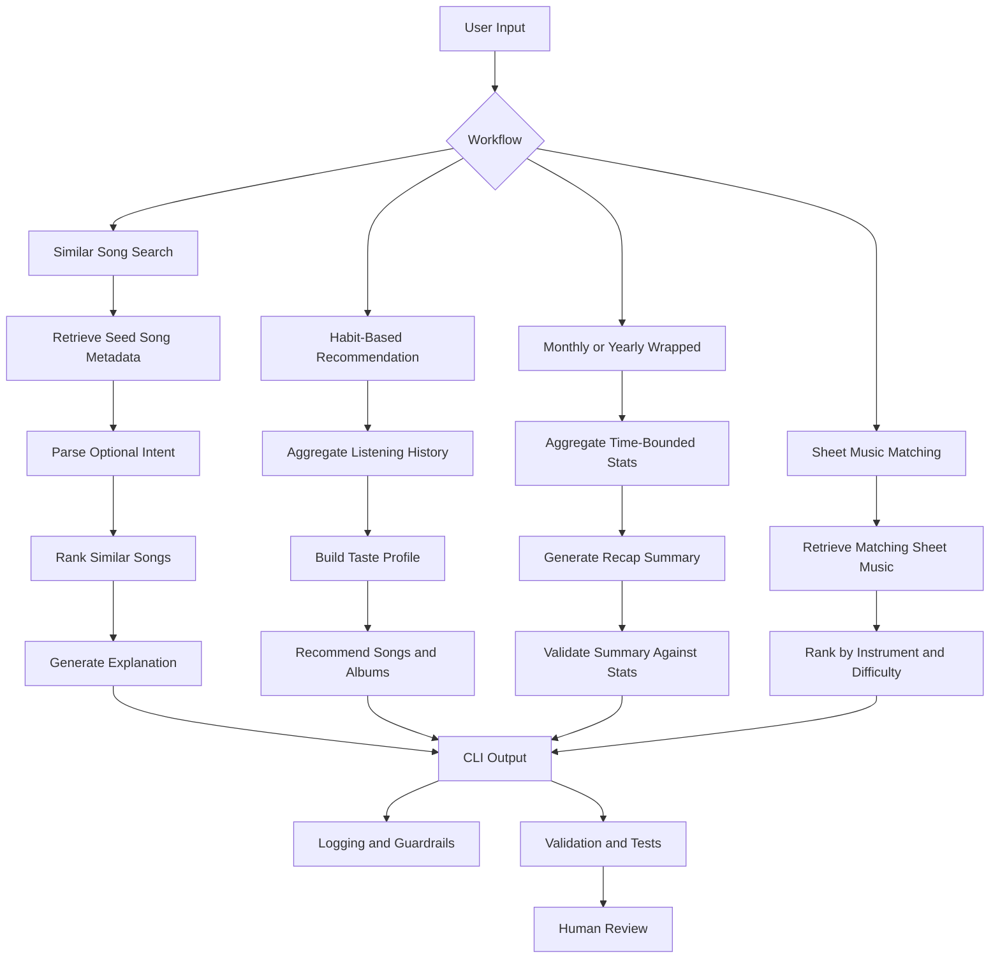

# Music Companion

## Project Overview
Music Companion is an AI-powered music discovery and reflection app built on top of a base content-based recommender. The original project ranked songs from a small catalog using handcrafted feature matching. This expanded version keeps that explainable scoring core and extends it into a broader AI-assisted music experience with four user-facing workflows:

1. Similar-song recommendation from a searched song
2. Personalized song and album recommendation from listening history
3. Monthly and yearly listening recap generation
4. Sheet music matching for light music, especially piano and guitar

This project integrates Retrieval-Augmented Generation (RAG), Gemini-powered intent parsing, and a reliability-focused validation layer into its main application logic.

Its main goal is to show how retrieval, ranking, summarization, and guardrails can work together inside one music application.

## Original Project
This project extends the original **Music Recommender Simulation** from Modules 1 to 3. The original version represented songs and user preferences as structured data, applied weighted feature matching to score songs, and returned ranked recommendations with short explanations. It already supported multiple scoring modes and diversity-aware ranking, but it did not yet include retrieval-driven song search, listening-history analysis, recap generation, or sheet music matching.

## Base Functionality
The base project is a content-based music recommender simulation. Each song in the catalog is represented with structured metadata such as genre, mood, energy, acousticness, instrumentalness, popularity, decade, language, duration, and mood tags. A user profile stores preferences over those features, and the system assigns a score to each song based on how closely the song matches the profile.

The current scoring engine in [src/recommender.py](src/recommender.py) includes:

- weighted feature matching
- multiple scoring modes
- optional diversity penalties
- human-readable explanations for each recommendation

This base logic remains the ranking backbone of the app.

## AI-Enhanced Functionality
The extended project adds four AI-related workflows on top of the scoring engine.

### 1. Similar Song Recommendation
The user searches for a song, and the system retrieves the seed song's metadata before finding other songs with similar attributes such as genre, mood, energy, decade, language, and tags. The user can also provide a natural-language intent, such as "more energetic but still instrumental for studying." When a `GEMINI_API_KEY` is available, Gemini parses that intent into structured ranking adjustments; otherwise, the app falls back to a local rule-based parser. If Gemini times out or returns an invalid response, the fallback happens automatically and the CLI displays the fallback source.

Implemented CLI:

```bash
python3 -m src.main similar --song "Song Title"
python3 -m src.main similar --song "Library Rain" --intent "more energetic but still instrumental for studying"
```

### 2. Habit-Based Recommendation
The system analyzes a user's listening history, builds a taste profile, and recommends songs and albums that fit that profile.

Planned CLI:

```bash
python3 -m src.main recommend --user user_001
```

### 3. Monthly and Yearly Music Wrapped
The system aggregates a user's listening history by month or year and generates a recap with top songs, top artists, top albums, and a natural-language taste summary.

Planned CLI:

```bash
python3 -m src.main wrapped --user user_001 --period year --year 2026
```

### 4. Sheet Music Matching
The system finds sheet music entries that best match a requested song, instrument, and optionally a difficulty level. The first version focuses on metadata-based matching for piano and guitar.

Planned CLI:

```bash
python3 -m src.main sheet --song "River Flows in You" --instrument piano
```

## AI Integration
This project treats AI as part of the main application flow, not as a standalone add-on.

### Retrieval-Augmented Generation
Before the system generates recommendations, summaries, or explanations, it first retrieves structured context:

- song metadata for searched songs
- listening history statistics for user recaps
- album metadata for habit-based recommendation
- sheet music metadata for instrument-specific matching

The generated output is therefore grounded in retrieved data rather than produced from an empty prompt.

### Gemini Intent Parsing
For similar-song search, Gemini is used as a constrained intent parser. It does not directly choose songs. Instead, it converts natural-language requests into structured fields such as `energy_delta`, `preferred_mood`, `required_language`, and `preferred_tags`. The deterministic scoring engine then uses those fields to rank songs, which keeps the final recommendation explainable and testable.

### Reliability and Validation
The project also includes a reliability layer:

- recap outputs are checked against computed statistics
- missing or ambiguous queries trigger fallback behavior
- invalid inputs are handled safely
- retrieval and ranking steps are logged for debugging
- Gemini outputs are validated and clamped before they affect ranking
- a local rule-based parser is used when Gemini is unavailable

These guardrails are part of the application logic and are intended to reduce unsupported or misleading outputs.

## System Architecture
The system architecture diagram is stored in the `assets/` folder and can be embedded here as an image or represented as a Mermaid diagram.



## Architecture Overview
The system is organized around a retrieval-first pipeline. User input enters through the command-line interface and is routed into one of the main workflows: similar-song search, habit-based recommendation, listening recap, or sheet music matching. Each workflow retrieves structured context from the relevant dataset before ranking, summarization, or matching takes place. The output is then checked through validation, logging, planned automated tests, and human review so that the system can surface grounded results and make failures easier to inspect.

## Repository Structure
```text
src/
data/
tests/
assets/
README.md
model_card.md
requirements.txt
```

## Data
### Current Dataset
The repository currently includes [data/songs.csv](data/songs.csv), which stores the music catalog used by the base recommender.

### Planned Datasets
The full application design also expects:

- `data/albums.csv` for album-level metadata
- `data/listening_history.csv` for user listening logs with timestamps
- `data/sheet_music.csv` for sheet music matching

These datasets will support features 2 to 4.

## Setup
### 1. Create a virtual environment
```bash
python3 -m venv .venv
source .venv/bin/activate
```

### 2. Install dependencies
```bash
pip install -r requirements.txt
```

### 3. Optional: configure Gemini
Gemini intent parsing is optional. If no API key is configured, the app uses a local fallback parser. If Gemini is configured but times out or fails, the app automatically uses the fallback parser and reports the fallback reason.

```bash
export GEMINI_API_KEY="your-api-key"
```

The default Gemini model is `gemini-2.5-flash`. You can override it if needed:

```bash
export GEMINI_MODEL="gemini-2.0-flash"
```

Do not commit API keys to the repository. Local `.env` files are ignored by git.

### 4. Run the current base application
```bash
python3 -m src.main
```

## How to Run
### Current Working Flows
The repository currently supports the base recommender demo through:

```bash
python3 -m src.main
```

It also supports Feature 1, similar-song recommendation:

```bash
python3 -m src.main similar --song "Library Rain"
python3 -m src.main similar --song "Library Rain" --intent "more energetic but still instrumental for studying"
python3 -m src.main similar --song "Library Rain" --intent "more energetic but still instrumental for studying" --no-gemini
```

### CLI Flags and Confidence Scores
The `--k` flag controls how many recommendations are returned. For example, `--k 3` returns the top three similar songs; it does not control whether Gemini is called.

Gemini is only used when the user provides `--intent` and a `GEMINI_API_KEY` is available. If `--no-gemini` is provided, the app always uses the local rule-based parser.

The CLI reports three different scoring concepts:

- **Search confidence:** how confidently the system matched the user's song query to a seed song.
- **Intent confidence:** how confidently Gemini or the fallback parser understood the natural-language intent.
- **Song score:** how well each recommended song matches the final adjusted profile.

For common requests, the local rule-based fallback often agrees with Gemini. For more nuanced language, Gemini provides more flexible intent extraction, while the fallback keeps the app reliable if the API fails. If Gemini fails, the app reports a fallback reason such as `HTTPError_403`, `HTTPError_429`, or `URLError`.

### Planned Extended Commands
These commands represent the target interface for the remaining expanded workflows:

```bash
python3 -m src.main recommend --user user_001
python3 -m src.main wrapped --user user_001 --period month --month 2026-04
python3 -m src.main wrapped --user user_001 --period year --year 2026
python3 -m src.main sheet --song "Song Title" --instrument piano
```

## Example Workflows
The following workflows describe the command-line interface for the expanded app. Similar-song search is implemented; the remaining workflows will be added incrementally.
### Example 1: Similar Song Search
Input:

```bash
python3 -m src.main similar --song "Yellow"
```

Target output:

- retrieved seed song
- top similar songs
- explanation of shared features

Current example output summary:

- Query: `Library Rain`
- Matched seed song: `Library Rain` by `Paper Lanterns`
- Search confidence: `1.00`
- Top similar results include `Midnight Coding`, `Focus Flow`, and `Spacewalk Thoughts`
- With intent `more energetic but still instrumental for studying`, the parser increases target energy, keeps instrumental preference, adds a focused tag, and moves `Focus Flow` to the top result.

Example interaction summary:

- The system identifies the searched song as the seed track.
- It retrieves the seed track's metadata and builds a similarity profile.
- It returns several similar songs along with a brief explanation of the shared features.

### Example 2: Habit-Based Recommendation
Input:

```bash
python3 -m src.main recommend --user user_001
```

Target output:

- recommended songs
- recommended albums
- short taste profile summary

Example interaction summary:

- The system aggregates the user's listening history into a taste profile.
- It retrieves and ranks songs and albums that align with the user's dominant genres, moods, and energy patterns.
- It summarizes the user's overall listening habits in a few sentences.

### Example 3: Yearly Wrapped
Input:

```bash
python3 -m src.main wrapped --user user_001 --period year --year 2026
```

Target output:

- top 10 songs
- top artists
- top albums
- yearly taste summary

Example interaction summary:

- The system filters listening history by the requested time period.
- It computes the user's most-played songs, artists, and albums for that period.
- It generates a concise taste summary grounded in those statistics.

### Example 4: Sheet Music Matching
Input:

```bash
python3 -m src.main sheet --song "River Flows in You" --instrument piano
```

Target output:

- matching sheet music entries
- instrument fit
- difficulty notes

Example interaction summary:

- The system retrieves sheet music entries that match the requested song and instrument.
- It ranks the best matches using instrument fit and optional difficulty.
- It returns the most suitable sheet music result with a short explanation.

## Demo Walkthrough
Add one of the following before submission:

- a Loom link showing the system end to end with at least 2 to 3 example inputs
- or a walkthrough using screenshots or GIFs stored in `assets/`

Suggested demo files:

- `assets/demo-similar.png`
- `assets/demo-recommend.png`
- `assets/demo-wrapped.png`
- `assets/demo-sheet.png`

## Existing Screenshots
The repository already includes several screenshots from the original recommender experiments. These are stored in `assets/` and can be retained as evidence of the base system behavior, but the final submission should also include updated screenshots for the expanded workflows.

- 
- 
- 
- 
- 
- 
- 

## Logging and Guardrails
The expanded system is planned to include:

- structured logging for retrieval, ranking, and recap generation
- safe handling of missing song queries
- input validation for command arguments
- recap validation against computed statistics
- fallback messaging for insufficient listening history or missing sheet music

## Current Testing Status
Run the current test suite with:

```bash
pytest
```

At the moment, the repository includes starter tests for the base recommender and new tests for Feature 1. The remaining extended workflows are still being implemented, so their reliability checks are documented as a testing plan rather than completed results.

## Testing Plan
The expanded test plan should cover:

- seed-song retrieval correctness
- Gemini/rule-based intent parsing validation
- similar-song ranking behavior
- user taste aggregation from history
- monthly and yearly recap statistics
- recap validation logic
- sheet music matching behavior
- edge cases for missing or ambiguous data

## Testing Summary
The current test suite passes with `12 passed`. These tests cover the base recommender, exact and partial song search, seed-song profile construction, similar-song ranking, seed exclusion, missing-query error handling, local intent parsing, Gemini fallback labeling, validation of unsafe intent values, and intent-based profile adjustment. What is already clear from the existing system is that transparent scoring helps with debugging, while sparse metadata and exact-match rules can still produce brittle recommendations. End-to-end testing results for the remaining workflows will be added after implementation and verification.

## Design Decisions
- The project keeps the original rule-based scoring engine because it is transparent, explainable, and easier to validate than a fully opaque recommendation model.
- Retrieval happens before generation so that recommendations, summaries, and explanations are grounded in structured music data rather than produced from an empty prompt.
- The system is organized as multiple focused workflows instead of one general chatbot so that each use case can be developed, tested, and debugged separately.
- Validation and logging are treated as product features rather than afterthoughts because recommendation systems can sound convincing even when their outputs are unsupported.
- The current design favors explainability and reproducibility over maximum realism; this is a deliberate trade-off given the project scope and dataset size.

## Results and Observations
The base recommender already demonstrates several useful behaviors:

- explainable weighted ranking
- multiple scoring modes
- diversity-aware ranking
- stress testing with adversarial user profiles

At the same time, the current system also reveals important limitations:

- strong dependence on catalog coverage
- exact-match rigidity for mood and genre
- underuse of some available metadata fields
- possible feedback loops from popularity and language imbalance

These observations motivate the move toward retrieval-driven workflows and stronger validation in the expanded app.

## Limitations
- The current catalog is small and partially simulated.
- Metadata quality strongly affects recommendation quality.
- The current recommender is still metadata-based rather than audio-based.
- Planned recap features depend on the quality of listening-history data.
- Planned sheet music matching is based on metadata retrieval, not automatic transcription.

## Future Work
- AI performer workflows
- Suno-style reinterpretation prompts
- multi-instrument arrangement planning
- audio embedding similarity instead of metadata-only matching
- richer album and playlist recommendation

## Reflection
Building Music Companion reinforced that useful AI systems depend on more than generation alone. Retrieval, ranking, validation, and fallback behavior all matter if the system is expected to produce outputs that are understandable and trustworthy. This project also highlighted a practical trade-off: explainable systems are easier to debug and document, but they still depend heavily on the quality and coverage of the underlying data. For a deeper discussion of biases, risks, testing, and human-AI collaboration, see [model_card.md](model_card.md).
